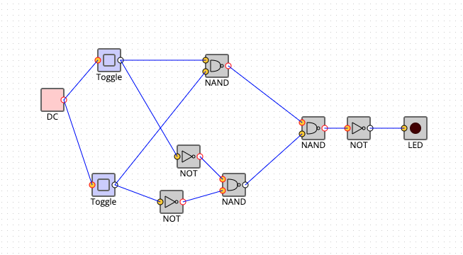

## 2.3
> NAND と NOR とインバータのゲートを使って排他的論理和(XOR)関数を提供する回路を設計しましょう。ただし、これら全部の種類のゲートを、必ず使う必要はありません。

| A    | B    | A nand B | ¬A nand ¬B | (A nand B) nand (¬A nand ¬B) | A xor B |
| :--: | :--: | :------: | :--------: | :--------------------------: | :-----: |
| 0    | 0    | 1        | 0          | 1                            | 0       |
| 1    | 0    | 1        | 1          | 0                            | 1       |
| 0    | 1    | 1        | 1          | 0                            | 1       |
| 1    | 1    | 0        | 1          | 1                            | 0       |

- [SimcirJS](https://kazuhikoarase.github.io/simcirjs/#-MmbL3QKh8GXrO2Nsms_)
- [別解](https://ja.wikipedia.org/wiki/XOR%E3%82%B2%E3%83%BC%E3%83%88)

## 2.8
> あるカウンタのチップに 16 本のピンがあるとしたら、そのカウンタの出力は最大で何ビットですか？
ヒント:チップにはパワーとグランドの端子も必要です。
- 12ビット.
- power(Vcc), GND, 入力, リセット入力を除いて最大12ピンが出力に使えるため.
- 備考：
    - 14ステージバイナリカウンタとかいうのもあるが、出力できるのは12bit分の情報量しかなさそう.
    - [参考](https://www.marutsu.co.jp/contents/shop/marutsu/datasheet/tc74hc4040ap.pdf)
