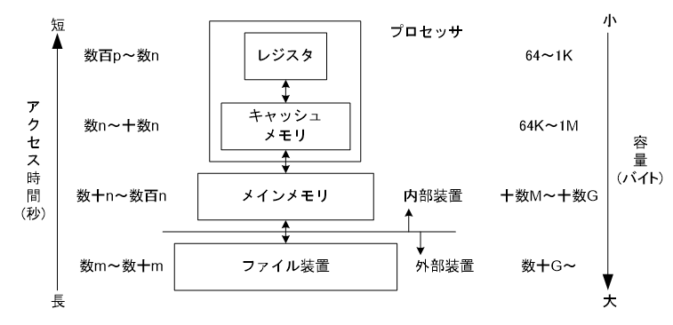

## 10.1
>ストレージの階層構造を定義して, 一例をあげてください.

出典: [日経XTECH](https://xtech.nikkei.com/dm/atcl/lecture/15/359175/080500034/?P=2)

## 10.6
>揮発性メモリにストアされたデータは, 電源が失われたとき, どうなりますか？

揮発性メモリの定義から, 内容は失われる.

## 10.11
>もしコンピュータがハーバード・アーキテクチャにしたがっていたら, 2つの同じメモリを持つと思いますか？ (片方は命令用, もう片方はデータ用に.) 理由も教えて下さい.

命令用のメモリへのアクセスは、命令をフェッチする数が圧倒的に多いので、より高価で高速なメモリを使用する効果が高い. 一方でデータ用のメモリへのアクセス回数は相対的に低いため,
安価で低速なメモリでも大きな問題がない. 
そのため, 異なるメモリを使う方がコストに対する性能が高くなる.