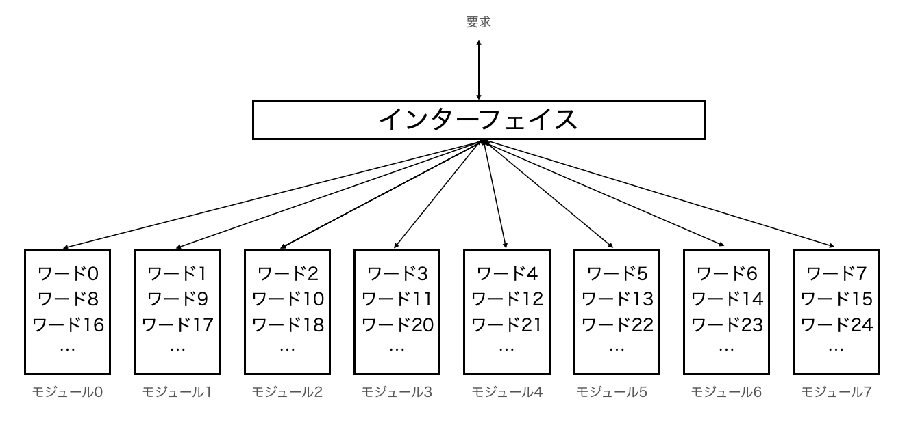

## 11. 5

> ARMプロセッサで、メモリから整数値をロードするとき、もしバイトアドレスが4の倍数でなければエラーになります。このようなエラーをなんと呼びますか。

11.16にあるように[不正アライメントエラー](http://www5d.biglobe.ne.jp/~noocyte/Programming/Alignment.html#AlignmentStrictCPU)を発生させる。

## 11.10

>図11-11を8重インターリーブのメモリ用に書き直してみましょう。

上記のように、下位3ビットに基づいてワードを割り当てる。

