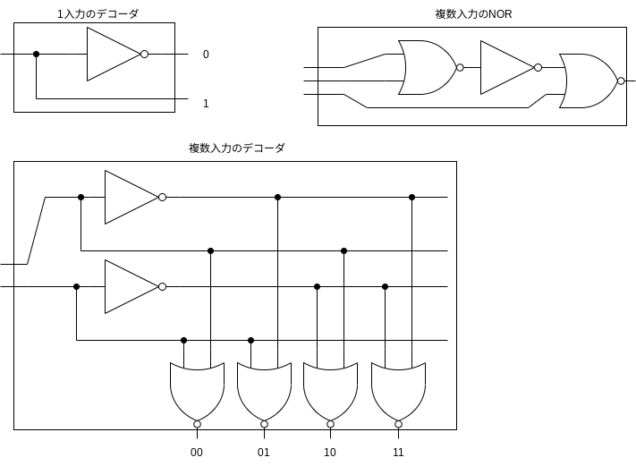

## 2.1
> VLSIチップにあるトランジスタの数とチップの物理的なサイズを調べましょう. 仮にdieの全域が使われるとしたら個々のトランジスタの大きさはどれくらいですか？

[日立 半導体の部屋5](https://www.hitachi-hightech.com/jp/products/device/semiconductor/ic.html)
> １つのICの中にトランジスタなどの素子を多数集積すると、その素子数で、LSI(1000素子以上)、VLSI（10万素子以上）、ULSI（1,000万素子以上）などと呼ばれます。

ICチップが数ミリから15ミリ角なので, VSLIにおける個々のトランジスタの大きさは$15^2/10^5 \approx 0.002\text{mm}^2$, 1辺は$0.047\text{mm}$.

参考までに, 日本人の髪の太さが平均0.08ミリらしい
https://www.kao.com/jp/haircare/hair/1-7/

## 2.6
> NANDとNORとインバータのゲートを使ってデコーダの回路を作りましょう

created by https://app.diagrams.net/
## 2.11
> ある回路に使っていないNORゲートが1個あるとします.その入力の1つを論理値1あるいは0に直結したらなにか役に立つ関数を作れるでしょうか.
- 1につないだとき, 常に0を返す関数ができる.
- 0につないだとき, インバータができる.
